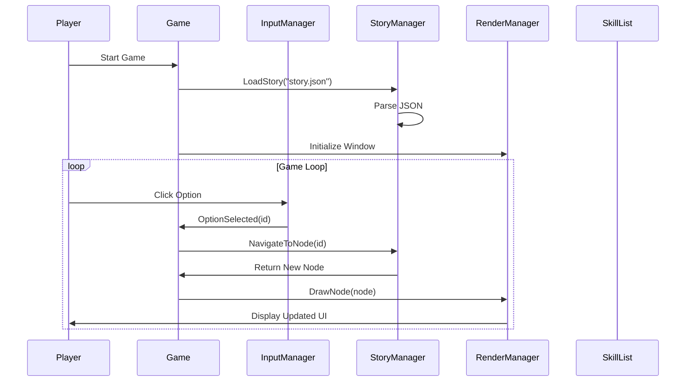

# Design Document

## Overview

Este documento describe el diseño de un juego interactivo de narrativa con interfaz gráfica usando SFML y C++. El sistema carga una historia ramificada desde un archivo JSON, permite al jugador navegar por diferentes caminos mediante decisiones, gestiona habilidades mágicas usando una lista enlazada, y presenta todo en una interfaz visual atractiva.

El juego sigue una arquitectura modular que separa claramente las responsabilidades: gestión de historia, renderizado, manejo de entrada, y estructuras de datos. Esta separación facilita el mantenimiento, testing y extensibilidad del sistema.

## Architecture

### High-Level Architecture

```
┌─────────────────────────────────────────────────────────┐
│                      Game (Main Loop)                    │
│  - Coordina todos los componentes                       │
│  - Maneja el game loop principal                        │
└────────┬────────────────────────────────────────────────┘
         │
         ├──────────────┬──────────────┬──────────────┐
         │              │              │              │
         ▼              ▼              ▼              ▼
┌────────────┐  ┌──────────────┐  ┌─────────┐  ┌──────────┐
│ StoryManager│  │RenderManager │  │InputMgr │  │SkillList │
│            │  │              │  │         │  │          │
│- Load JSON │  │- Draw UI     │  │- Mouse  │  │- Add     │
│- Navigate  │  │- Text        │  │- Keys   │  │- Remove  │
│- Get State │  │- Images      │  │- Events │  │- Display │
└────────────┘  └──────────────┘  └─────────┘  └──────────┘
```

### Component Interaction Flow



## Components and Interfaces

### 1. StoryNode

Representa un punto en la narrativa con su contenido y opciones.

```cpp
struct StoryOption {
    std::string id;           // "A", "B", etc.
    std::string text;         // Texto de la opción
    std::string nextNodeId;   // ID del siguiente nodo
};

class StoryNode {
public:
    std::string id;
    std::string title;
    std::string text;
    std::vector<StoryOption> options;
    bool isEnding;
    std::string outcome;      // "final_bueno", "final_malo", etc.
    std::string endingText;
    
    StoryNode();
    bool HasOptions() const;
    const StoryOption* GetOption(const std::string& optionId) const;
};
```

### 2. StoryManager

Gestiona la carga y navegación de la historia.

```cpp
class StoryManager {
public:
    StoryManager();
    ~StoryManager();
    
    // Carga la historia desde un archivo JSON
    bool LoadFromFile(const std::string& filepath);
    
    // Navega al nodo inicial
    void Start();
    
    // Navega a un nodo específico por ID
    bool NavigateToNode(const std::string& nodeId);
    
    // Selecciona una opción del nodo actual
    bool SelectOption(const std::string& optionId);
    
    // Obtiene el nodo actual
    const StoryNode* GetCurrentNode() const;
    
    // Verifica si la historia está en un final
    bool IsAtEnding() const;
    
private:
    std::map<std::string, StoryNode> m_nodes;
    std::string m_startNodeId;
    StoryNode* m_currentNode;
    
    void ParseJSON(const nlohmann::json& jsonData);
    StoryNode ParseNode(const nlohmann::json& nodeJson);
};
```

### 3. RenderManager

Gestiona el renderizado de todos los elementos visuales.

```cpp
class RenderManager {
public:
    RenderManager(sf::RenderWindow& window);
    ~RenderManager();
    
    // Inicializa recursos (fuentes, texturas)
    bool Initialize();
    
    // Dibuja el nodo actual de la historia
    void DrawStoryNode(const StoryNode* node);
    
    // Dibuja la lista de habilidades
    void DrawSkillList(const SkillList& skills);
    
    // Dibuja una imagen asociada al nodo
    void DrawNodeImage(const std::string& imagePath);
    
    // Limpia la pantalla
    void Clear(const sf::Color& color = sf::Color::Black);
    
    // Muestra lo dibujado
    void Display();
    
    // Obtiene el índice de la opción bajo el mouse (-1 si ninguna)
    int GetHoveredOption(const sf::Vector2i& mousePos) const;
    
private:
    sf::RenderWindow& m_window;
    sf::Font m_font;
    sf::Texture m_currentTexture;
    sf::Sprite m_currentSprite;
    
    std::vector<sf::FloatRect> m_optionBounds;  // Para detección de hover
    
    void DrawText(const std::string& text, const sf::Vector2f& position, 
                  unsigned int size, const sf::Color& color);
    void WrapText(const std::string& text, float maxWidth, 
                  std::vector<std::string>& lines);
};
```

### 4. InputManager

Maneja la entrada del usuario.

```cpp
class InputManager {
public:
    InputManager(sf::RenderWindow& window);
    
    // Procesa todos los eventos pendientes
    void ProcessEvents();
    
    // Verifica si se solicitó cerrar la ventana
    bool ShouldClose() const;
    
    // Obtiene la posición del mouse
    sf::Vector2i GetMousePosition() const;
    
    // Verifica si se hizo click izquierdo este frame
    bool WasLeftClicked() const;
    
    // Verifica si se presionó Escape
    bool WasEscapePressed() const;
    
    // Resetea el estado del frame
    void ResetFrameState();
    
private:
    sf::RenderWindow& m_window;
    bool m_shouldClose;
    bool m_leftClicked;
    bool m_escapePressed;
};
```

### 5. SkillList (Ya existente, con mejoras)

Lista enlazada para gestionar habilidades.

```cpp
// Node.h
struct Node {
    std::string data;
    Node* next;
    Node(const std::string& data);
};

// SkillList.h
class SkillList {
public:
    SkillList();
    ~SkillList();
    
    void AddSkill(const std::string& data);
    void DeleteHead();
    bool DeleteSkillAt(int index);
    bool ReplaceSkillAt(int index, const std::string& newData);
    void Show() const;
    void Clear();
    int Count() const;
    
    // Nueva función para obtener skill por índice (para renderizado)
    std::string GetSkillAt(int index) const;
    
private:
    Node* head;
};
```

### 6. Game (Clase principal)

Coordina todos los componentes y ejecuta el game loop.

```cpp
class Game {
public:
    Game();
    ~Game();
    
    // Inicializa el juego
    bool Initialize();
    
    // Ejecuta el game loop principal
    void Run();
    
private:
    sf::RenderWindow m_window;
    StoryManager m_storyManager;
    RenderManager m_renderManager;
    InputManager m_inputManager;
    SkillList m_skills;
    
    bool m_isRunning;
    
    void Update();
    void Render();
    void HandleInput();
};
```

## Data Models

### JSON Story Format

```json
{
  "startNodeId": "n1",
  "nodes": [
    {
      "id": "n1",
      "title": "Título del nodo",
      "text": "Texto descriptivo de la escena",
      "options": [
        {
          "id": "A",
          "text": "Primera opción",
          "nextNodeId": "n2"
        },
        {
          "id": "B",
          "text": "Segunda opción",
          "nextNodeId": "n3"
        }
      ]
    },
    {
      "id": "n2",
      "title": "Final",
      "text": "Texto del final",
      "ending": true,
      "outcome": "final_bueno",
      "textEnding": "Descripción extendida del final"
    }
  ]
}
```

### Memory Layout - SkillList

```
SkillList
  |
  head --> [Node: "Fireball"] --> [Node: "Ice Spike"] --> [Node: "Healing"] --> nullptr
           data: "Fireball"       data: "Ice Spike"      data: "Healing"
           next: --------->        next: --------->       next: nullptr
```

## Correctness Properties

*A property is a characteristic or behavior that should hold true across all valid executions of a system-essentially, a formal statement about what the system should do. Properties serve as the bridge between human-readable specifications and machine-verifiable correctness guarantees.*


### Property 1: Node count consistency
*For any* valid story JSON file with N nodes, parsing should create exactly N StoryNode objects accessible in the system.
**Validates: Requirements 1.2**

### Property 2: UTF-8 round trip
*For any* string containing UTF-8 Spanish characters (tildes, ñ, special symbols), parsing from JSON and converting back should preserve the exact character sequence.
**Validates: Requirements 1.4**

### Property 3: Start node identification
*For any* valid story JSON with a startNodeId field, after loading, the current node's ID should match the startNodeId value.
**Validates: Requirements 1.5**

### Property 4: Option display completeness
*For any* StoryNode with N options, the display system should render exactly N selectable choices.
**Validates: Requirements 2.2**

### Property 5: Navigation correctness
*For any* StoryNode and any valid option on that node, selecting the option should transition to the node whose ID matches the option's nextNodeId.
**Validates: Requirements 2.3**

### Property 6: Ending node finality
*For any* StoryNode with ending flag set to true, attempting to navigate to another node should fail or be prevented.
**Validates: Requirements 2.4**

### Property 7: Text wrapping bounds
*For any* text string and window width W, after line wrapping, no rendered line should exceed width W pixels.
**Validates: Requirements 3.5**

### Property 8: Skill addition increases count
*For any* SkillList with count N, adding a skill should result in count N+1, and the new skill should be accessible at index N.
**Validates: Requirements 4.2**

### Property 9: Skill display completeness
*For any* SkillList with N skills, iterating through the list should yield exactly N skills with indices 0 through N-1.
**Validates: Requirements 4.3**

### Property 10: List integrity after removal
*For any* SkillList, after removing a skill at any valid index, traversing the list from head to end should visit all remaining nodes exactly once without encountering null pointers prematurely.
**Validates: Requirements 4.4**

### Property 11: Event queue exhaustion
*For any* frame with N events in the SFML event queue, processing events should handle all N events before the frame ends.
**Validates: Requirements 5.4**

### Property 12: Event processing order
*For any* sequence of events E1, E2, ..., En added to the queue in that order, they should be processed in the same order E1, E2, ..., En.
**Validates: Requirements 5.5**

### Property 13: Image scaling bounds
*For any* image with dimensions (W, H) and display area (maxW, maxH), the scaled image dimensions should satisfy: scaledW ≤ maxW AND scaledH ≤ maxH.
**Validates: Requirements 6.4**

### Property 14: SkillList memory cleanup
*For any* SkillList with N nodes, after destruction, all N Node objects should be deallocated (no memory leaks).
**Validates: Requirements 7.1**

### Property 15: Exception safety
*For any* operation that throws an exception, all resources allocated before the exception should be properly released.
**Validates: Requirements 7.4**

### Property 16: Immediate node deletion
*For any* SkillList, after removing a node at index I, the Node object that was at index I should be immediately deleted (no dangling pointers).
**Validates: Requirements 7.5**

## Error Handling

### JSON Loading Errors

```cpp
enum class LoadError {
    FileNotFound,
    InvalidJSON,
    MissingStartNode,
    MissingRequiredField,
    InvalidNodeReference
};

class StoryLoadException : public std::runtime_error {
public:
    StoryLoadException(LoadError error, const std::string& details);
    LoadError GetError() const;
private:
    LoadError m_error;
};
```

**Error Handling Strategy:**
- File not found: Display error message with file path, terminate gracefully
- Invalid JSON: Display parsing error with line number if available, terminate gracefully
- Missing start node: Display error indicating startNodeId not found in nodes array
- Invalid node reference: Log warning, allow game to continue but prevent navigation to invalid node
- UTF-8 decoding errors: Log warning, replace invalid characters with '?', continue

### Memory Allocation Errors

```cpp
// En SkillList::AddSkill
void SkillList::AddSkill(const std::string& data) {
    try {
        Node* newNode = new Node(data);
        // ... rest of logic
    } catch (const std::bad_alloc& e) {
        std::cerr << "Error: No se pudo asignar memoria para nueva habilidad" << std::endl;
        throw;  // Re-throw para que el caller maneje
    }
}
```

### SFML Resource Errors

```cpp
bool RenderManager::Initialize() {
    if (!m_font.loadFromFile("assets/Roboto-Regular.ttf")) {
        std::cerr << "Error: No se pudo cargar la fuente Roboto-Regular.ttf" << std::endl;
        return false;
    }
    return true;
}
```

### Navigation Errors

```cpp
bool StoryManager::NavigateToNode(const std::string& nodeId) {
    auto it = m_nodes.find(nodeId);
    if (it == m_nodes.end()) {
        std::cerr << "Error: Nodo no encontrado: " << nodeId << std::endl;
        return false;  // Mantener nodo actual
    }
    m_currentNode = &(it->second);
    return true;
}
```

## Testing Strategy

### Unit Testing

Usaremos un framework de testing simple para C++ (puede ser Google Test o un framework mínimo custom). Los unit tests cubrirán:

**SkillList Tests:**
- Test de lista vacía inicial
- Test de agregar un skill
- Test de agregar múltiples skills
- Test de eliminar el primer skill
- Test de eliminar skill en medio de la lista
- Test de eliminar skill al final
- Test de eliminar de lista vacía (debe fallar gracefully)
- Test de reemplazar skill en índice válido
- Test de reemplazar skill en índice inválido
- Test de Count() con diferentes tamaños de lista
- Test de Clear() libera toda la memoria

**StoryManager Tests:**
- Test de cargar JSON válido
- Test de cargar JSON con nodo faltante
- Test de navegación a nodo válido
- Test de navegación a nodo inválido
- Test de seleccionar opción válida
- Test de seleccionar opción inválida
- Test de detectar nodos finales

**RenderManager Tests:**
- Test de inicialización con fuente válida
- Test de inicialización con fuente faltante
- Test de GetHoveredOption con diferentes posiciones de mouse

### Property-Based Testing

Usaremos **RapidCheck** como librería de property-based testing para C++. RapidCheck es una implementación de QuickCheck para C++ que permite generar datos aleatorios y verificar propiedades.

**Configuración:**
- Cada property test ejecutará un mínimo de 100 iteraciones
- Los generadores crearán datos aleatorios pero válidos según las restricciones del dominio
- Cada test debe estar etiquetado con un comentario que referencie la propiedad del diseño

**Property Tests a Implementar:**

1. **Property 1: Node count consistency**
   - Generar: JSON válido con N nodos aleatorios (1 ≤ N ≤ 50)
   - Verificar: StoryManager.GetNodeCount() == N

2. **Property 2: UTF-8 round trip**
   - Generar: Strings con caracteres españoles aleatorios (á, é, í, ó, ú, ñ, ¿, ¡)
   - Verificar: parse(serialize(str)) == str

3. **Property 3: Start node identification**
   - Generar: JSON con startNodeId aleatorio que existe en nodes
   - Verificar: GetCurrentNode().id == startNodeId después de Load()

4. **Property 4: Option display completeness**
   - Generar: StoryNode con N opciones aleatorias (0 ≤ N ≤ 10)
   - Verificar: RenderManager devuelve N elementos renderizables

5. **Property 5: Navigation correctness**
   - Generar: Grafo de nodos aleatorio con opciones válidas
   - Verificar: Para cada opción, SelectOption(id) lleva al nextNodeId correcto

6. **Property 6: Ending node finality**
   - Generar: Nodo con ending=true
   - Verificar: Intentar navegar desde ese nodo falla

7. **Property 7: Text wrapping bounds**
   - Generar: Texto aleatorio y ancho de ventana aleatorio
   - Verificar: Todas las líneas wrapeadas ≤ ancho especificado

8. **Property 8: Skill addition increases count**
   - Generar: SkillList con N skills, agregar uno más
   - Verificar: Count() == N+1 y GetSkillAt(N) == nuevo skill

9. **Property 9: Skill display completeness**
   - Generar: SkillList con N skills aleatorios
   - Verificar: Iterar produce exactamente N skills

10. **Property 10: List integrity after removal**
    - Generar: SkillList con N skills, índice válido I
    - Verificar: Después de DeleteSkillAt(I), Count() == N-1 y traversal completo

11. **Property 11: Event queue exhaustion**
    - Generar: N eventos SFML aleatorios
    - Verificar: Después de ProcessEvents(), cola está vacía

12. **Property 12: Event processing order**
    - Generar: Secuencia de eventos E1, E2, ..., En
    - Verificar: Procesados en orden FIFO

13. **Property 13: Image scaling bounds**
    - Generar: Dimensiones de imagen aleatorias, área de display aleatoria
    - Verificar: Imagen escalada cabe en el área

14. **Property 14: SkillList memory cleanup**
    - Generar: SkillList con N nodes
    - Verificar: Después de destructor, no hay memory leaks (usar herramienta como Valgrind)

15. **Property 15: Exception safety**
    - Generar: Operaciones que pueden lanzar excepciones
    - Verificar: Recursos liberados correctamente después de catch

16. **Property 16: Immediate node deletion**
    - Generar: SkillList, índice válido
    - Verificar: Después de DeleteSkillAt(), el puntero anterior es inválido

**Generadores Personalizados:**

```cpp
// Generador de StoryNode válido
namespace rc {
    template<>
    struct Arbitrary<StoryNode> {
        static Gen<StoryNode> arbitrary() {
            return gen::build<StoryNode>(
                gen::set(&StoryNode::id, gen::string<std::string>()),
                gen::set(&StoryNode::title, gen::string<std::string>()),
                gen::set(&StoryNode::text, gen::string<std::string>()),
                gen::set(&StoryNode::options, gen::container<std::vector<StoryOption>>()),
                gen::set(&StoryNode::isEnding, gen::arbitrary<bool>())
            );
        }
    };
}

// Generador de texto español con caracteres especiales
Gen<std::string> spanishText() {
    return gen::string(gen::oneOf(
        gen::inRange('a', 'z'),
        gen::inRange('A', 'Z'),
        gen::element('á', 'é', 'í', 'ó', 'ú', 'ñ', '¿', '¡')
    ));
}
```

### Integration Testing

Tests que verifican la interacción entre componentes:

1. **Test de flujo completo de juego:**
   - Cargar historia → Navegar por varios nodos → Llegar a un final
   - Verificar que el estado es consistente en cada paso

2. **Test de sincronización UI:**
   - Modificar SkillList → Verificar que RenderManager refleja cambios
   - Navegar a nuevo nodo → Verificar que se renderiza correctamente

3. **Test de manejo de recursos:**
   - Cargar múltiples imágenes → Navegar entre nodos → Verificar que texturas se liberan

### Test Organization

```
tests/
├── unit/
│   ├── test_skilllist.cpp
│   ├── test_storymanager.cpp
│   └── test_rendermanager.cpp
├── property/
│   ├── test_properties_skilllist.cpp
│   ├── test_properties_story.cpp
│   └── test_properties_rendering.cpp
└── integration/
    └── test_game_flow.cpp
```

## Implementation Notes

### File Structure

```
Minijuego/
├── src/
│   ├── main.cpp
│   ├── Game.h / Game.cpp
│   ├── StoryManager.h / StoryManager.cpp
│   ├── StoryNode.h / StoryNode.cpp
│   ├── RenderManager.h / RenderManager.cpp
│   ├── InputManager.h / InputManager.cpp
│   ├── SkillList.h / SkillList.cpp
│   └── Node.h / Node.cpp
├── assets/
│   ├── Roboto-Regular.ttf
│   ├── story.json
│   └── images/
│       ├── imagen1.png
│       ├── imagen2.png
│       └── ...
├── tests/
│   └── (test files)
└── external/
    ├── json.hpp
    ├── SFML/
    └── rapidcheck/
```

### Build System

Usar CMake para gestionar la compilación:

```cmake
cmake_minimum_required(VERSION 3.10)
project(InteractiveStoryGame)

set(CMAKE_CXX_STANDARD 17)

# SFML
find_package(SFML 3.0 COMPONENTS graphics window system REQUIRED)

# Source files
file(GLOB SOURCES "src/*.cpp")

# Executable
add_executable(game ${SOURCES})
target_link_libraries(game sfml-graphics sfml-window sfml-system)

# Tests (opcional)
enable_testing()
add_subdirectory(tests)
```

### Performance Considerations

1. **JSON Loading:** Cargar una sola vez al inicio, mantener en memoria
2. **Texture Caching:** Cargar texturas bajo demanda, mantener cache de las más usadas
3. **Text Rendering:** Pre-calcular line wrapping cuando cambia el nodo
4. **Linked List:** O(n) para acceso por índice es aceptable dado el tamaño pequeño esperado

### Extensibility Points

1. **Nuevos tipos de nodos:** Agregar campos al JSON y a StoryNode
2. **Efectos visuales:** Extender RenderManager con nuevos métodos de dibujo
3. **Sistema de guardado:** Agregar SaveManager que serializa el estado actual
4. **Múltiples historias:** StoryManager puede cargar diferentes archivos JSON
5. **Localización:** Agregar sistema de traducción basado en archivos JSON por idioma
